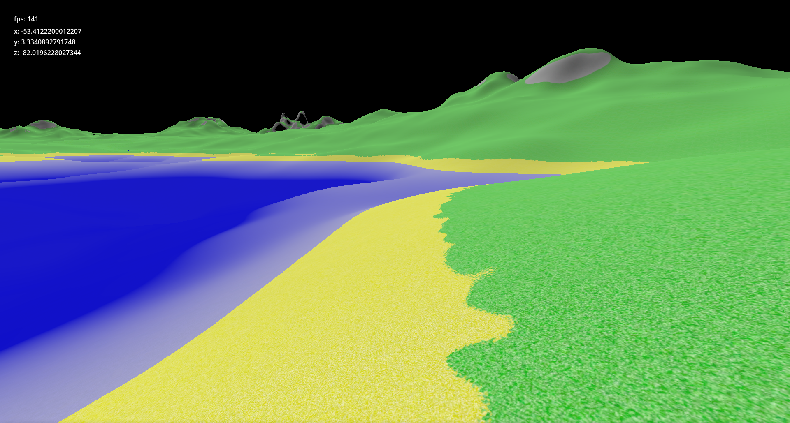

# 3D procedural large open world experiments

Trying to build a heightmap terrain system.

Once https://github.com/Zylann/godot_heightmap_plugin/ works on godot 4 (or godot 4 gets its own heightmap terrain) then that would probably be better to use, but for now that's not possible yet.

Drawing meshes and making collision heightmaps is something that works now.
The drawn mesh can be either a plane mesh that is then moved to the correct height in shaders (more efficient) or constructed in gdscript (less efficient).

## Planned improvements

- background loading/building of meshes and collision shapes
- include small dense objects like grass
